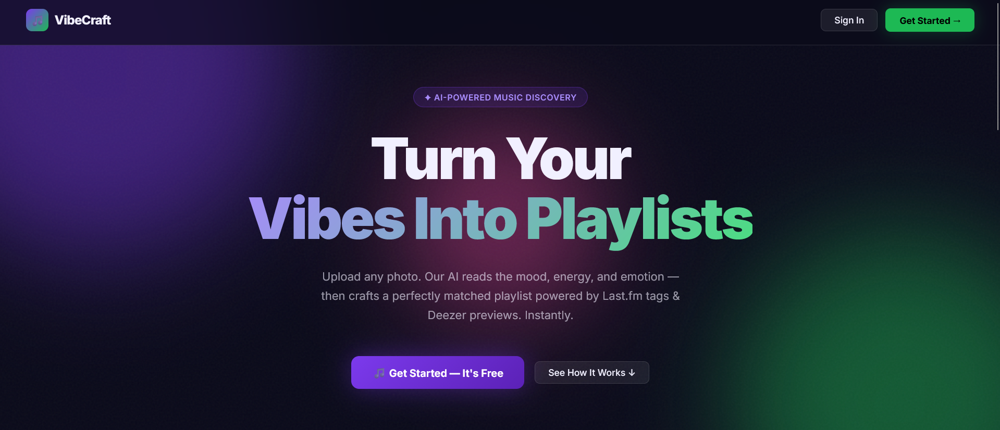
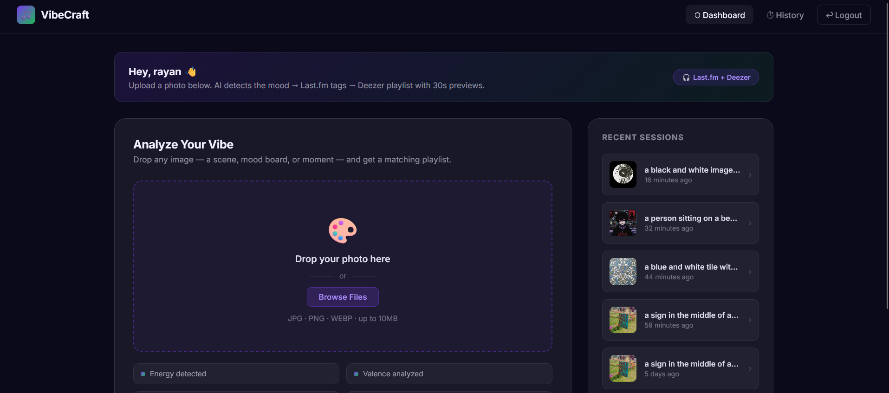
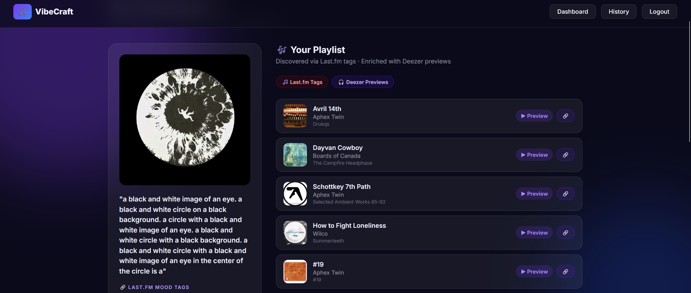

# 🎵 VibeCraft — AI-Powered Vibe Playlist Generator

> Upload a photo → AI detects the mood → Last.fm tags the vibe → Deezer generates a playable playlist.

[](https://php.net)
[](https://laravel.com)
[](https://python.org)
[](https://fastapi.tiangolo.com)

---

## 📸 Screenshots

| Welcome Page | Dashboard | Playlist Generation |
|:---:|:---:|:---:|
|  |  |  |

---

## 🏗 Architecture

```
📸 User uploads image
      ↓
🤖 AI Microservice (Python / FastAPI + BLIP vision model)
   └─ caption, keywords, energy, valence, tempo, acousticness
      ↓
🔗 Last.fm API  (Primary — mood tag discovery)
   └─ tag.getTopTracks(mood) → ranked track list
      ↓
🎧 Deezer API   (Secondary — playable content)
   └─ search(track+artist) → artwork + 30s MP3 preview + deep-link
      ↓
✅ Result page with audio previews in the browser
```

### Why Last.fm + Deezer instead of Spotify?

Spotify's Web API now requires a **Premium subscription** to register an application in many regions. Rather than block on a vendor limitation, this project demonstrates a **modular, vendor-agnostic architecture**:

| Layer | Provider | Auth Required? |
|-------|----------|---------------|
| Image analysis | Custom Python/BLIP AI | — |
| Mood tags | Last.fm (free API) | API key only |
| Playable tracks | Deezer (open search) | **None** |

This pattern — decoupling mood detection from playlist delivery — means any provider (Spotify, Apple Music, YouTube) can be swapped in without touching the AI or tagging layers.

---

## 🧠 The AI Microservice Deep Dive

Located in `ai-service/`, the Python AI microservice is the brain of the operation. It's built with **FastAPI** for high-performance async routing, **Salesforce's BLIP** (Bootstrapping Language-Image Pre-training) for vision-to-text generation, and **NLTK** for natural language processing.

### The Pipeline: How an Image Becomes a Vibe

When an image is uploaded, it passes through a 4-step pipeline:

#### 1. Multi-Prompt Image Captioning (BLIP)
A standard image caption (e.g., "a cup of coffee") isn't enough to generate a playlist. The AI runs the image through the BLIP model **four times** using different conditional prompts to extract different semantic layers:
- *Unconditional:* "a photo of..." (Captures the literal scene)
- *Conditional 1:* "the art style shown in this image is..." (Captures aesthetics)
- *Conditional 2:* "the mood and atmosphere of this image is..." (Captures emotion)
- *Conditional 3:* "the cultural or artistic theme is..." (Captures context)

These outputs are merged into one rich, descriptive paragraph.

#### 2. Dominant Colour & Lighting Extraction
The image is scaled down and its pixels are converted to the **HSV (Hue, Saturation, Value)** colour space. 
- High average *Value* injects keywords like `"bright"` or `"luminous"`.
- Low average *Value* injects keywords like `"shadowy"` or `"dark"`.
- High *Saturation* adds `"vibrant"`, low adds `"muted"` or `"monochrome"`.
- The dominant *Hue* is bucketed to inject temperature keywords (`"warm"`, `"cool"`, `"earthy"`).

#### 3. Natural Language Processing (NLTK)
The combined text (captions + colour traits) is cleaned and tokenized using NLTK. Stopwords are removed, and **Part-of-Speech (POS) tagging** is applied. The system selectively filters the text, keeping only **Nouns** (objects, scenes) and **Adjectives** (emotions, styles). 

#### 4. The `VIBE_MAP` & Cultural Routing
This is where vision becomes music. The system uses a heavily curated dictionary (`VIBE_MAP`) containing over 100 atmospheric and aesthetic words. 

If a word in the NLP output exists in the VIBE_MAP (e.g., `"melancholy"`, `"cyberpunk"`, `"neon"`), it applies mathematical deltas to four baseline Spotify-style audio features:
- **Energy:** Intensity and activity measure.
- **Valence:** Musical positiveness (happy vs. sad).
- **Tempo:** Estimated BPM.
- **Acousticness:** Likelihood the track is acoustic vs. electronic.

*Example:* The keyword `"cyberpunk"` increases Energy (+0.20), decreases Acousticness (-0.20), and increases Tempo (+15 BPM). The keyword `"rain"` drops Valence (-0.15) and Energy (-0.15).

Finally, a `STYLE_GENRE_MAP` scans the text for specific cultural or artistic hints (e.g., "zellij", "kimono", "cyberpunk") and translates them into **Priority 1 Last.fm Genre Tags** (e.g., "arabic", "japanese", "synthwave") to ensure the resulting tracks are stylistically accurate, not just emotionally accurate.

**Response payload:**
```json
{
  "caption": "a photo of a neon sign. the art style shown in this image is cyberpunk. the mood and atmosphere of this image is dark and futuristic.",
  "keywords": ["neon", "cyberpunk", "dark", "futuristic", "luminous", "city"],
  "genre_hints": ["synthwave", "electronic", "industrial"],
  "energy": 0.85,
  "valence": 0.35,
  "tempo": 145.0,
  "acousticness": 0.05
}
```

---

## 🚀 Running Locally

### Requirements
- PHP 8.3+, Composer
- Node 18+, npm
- Python 3.10+
- MySQL

### Setup

```bash
# 1. Clone & install PHP deps
git clone https://github.com/afrit-med-rayan/vibe-playlist-generator.git
cd vibe-playlist-generator
composer install

# 2. Configure environment
cp .env.example .env
php artisan key:generate
# Edit .env: set DB credentials + LASTFM_API_KEY

# 3. Run migrations
php artisan migrate

# 4. Install & build frontend
npm install

# 5. Install AI service deps
cd ai-service
python -m venv venv
venv\Scripts\activate   # Windows
pip install -r requirements.txt
cd ..
```

### Start all services

```bash
# Terminal 1 — Laravel
php artisan serve

# Terminal 2 — Vite
npm run dev

# Terminal 3 — AI microservice
cd ai-service
venv\Scripts\python -m uvicorn main:app --host 0.0.0.0 --port 8001 --reload
```

Open [http://localhost:8000](http://localhost:8000)

---

## 🔑 Environment Variables

| Variable | Description |
|----------|-------------|
| `DB_*` | MySQL connection settings |
| `LASTFM_API_KEY` | [Get free key →](https://www.last.fm/api/account/create) |
| `AI_SERVICE_URL` | Default: `http://localhost:8001` |

---

## 📁 Project Structure

```
vibe-playlist-generator/
├── app/
│   ├── Http/Controllers/
│   │   ├── AuthController.php      # Local register/login/logout
│   │   └── VibeController.php      # AI → Last.fm → Deezer pipeline
│   └── Services/
│       ├── LastFmService.php       # Mood tags + top tracks
│       └── DeezerService.php       # Cross-reference + preview URLs
├── ai-service/                     # Python FastAPI microservice
│   ├── main.py
│   ├── vibe_analyzer.py
│   └── requirements.txt
├── resources/views/
│   ├── auth/                       # register + login
│   ├── vibe/result.blade.php       # Playlist result with audio previews
│   └── dashboard.blade.php
└── database/migrations/
```

---

## 🛠 Tech Stack

| Layer | Technology |
|-------|-----------|
| Backend | Laravel 11 (PHP 8.3) |
| Frontend | Blade + Vanilla CSS (glassmorphism) |
| AI Service | Python 3, FastAPI, BLIP, NLTK, PyTorch |
| Music discovery | Last.fm free API |
| Playlist generation | Deezer open API |
| Database | MySQL |

---

*Built as a portfolio project demonstrating modular AI + music API integration.*
